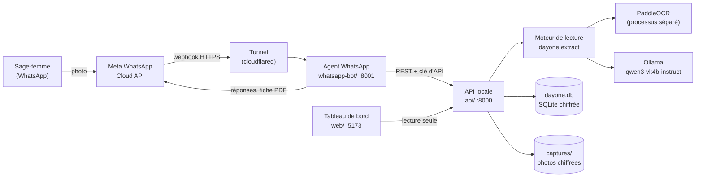
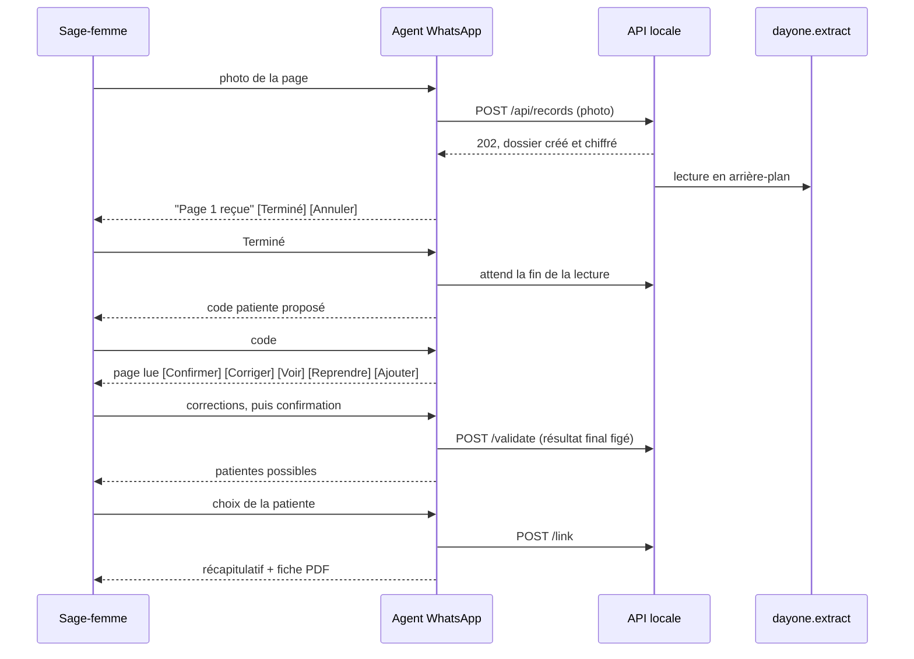
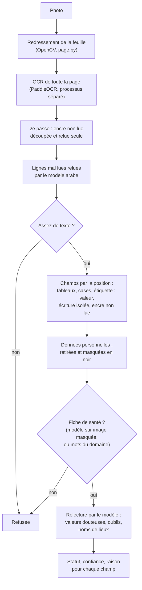
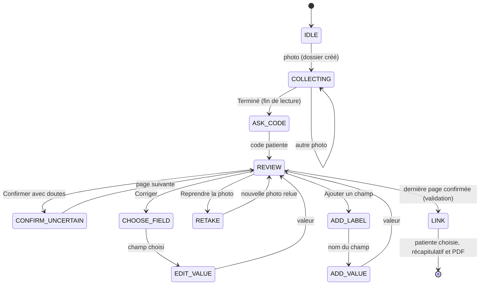
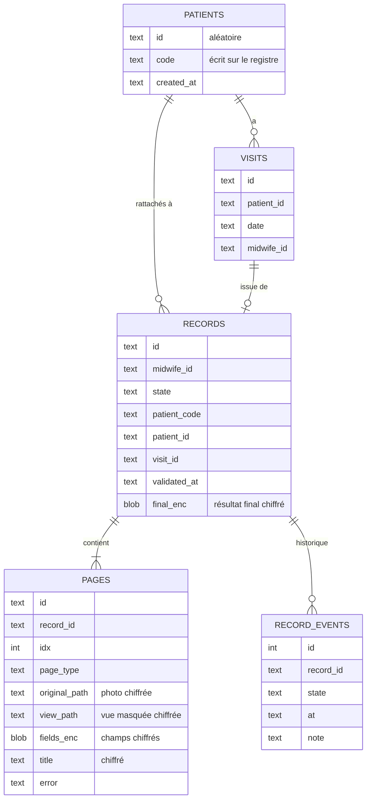
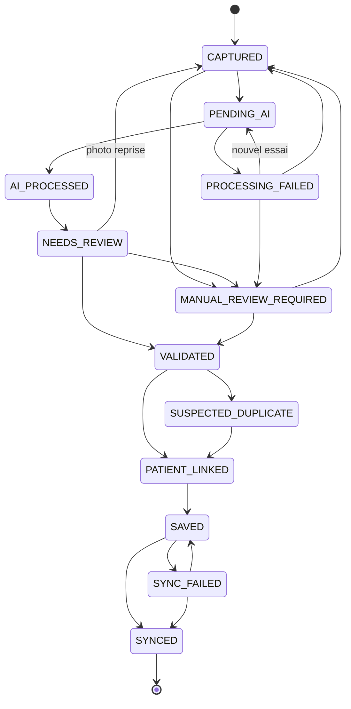

# DayOne

Numérisation du registre maternel papier par photo : une sage-femme photographie une page du registre sur
WhatsApp, DayOne la lit, lui fait vérifier ce qui est douteux, puis enregistre un dossier structuré, chiffré
et relié à la patiente.

Projet du hackathon CodeML 2026 (défi DayOne). Tout tourne en local, sans service tiers pour la lecture.
La lecture fonctionne sans gabarit : elle lit une fiche qu'elle n'a jamais vue, en français, en arabe ou
en anglais.

---

## Table des matières

1. [Vue d'ensemble](#1-vue-densemble)
2. [Architecture](#2-architecture)
3. [Démarrage rapide](#3-démarrage-rapide)
4. [Installation manuelle](#4-installation-manuelle)
5. [Configuration](#5-configuration)
6. [Lecture d'une fiche](#6-lecture-dune-fiche)
7. [Format d'un champ, statuts et raisons](#7-format-dun-champ-statuts-et-raisons)
8. [Données personnelles et sécurité](#8-données-personnelles-et-sécurité)
9. [Agent WhatsApp](#9-agent-whatsapp)
10. [API locale](#10-api-locale)
11. [Base de données et cycle de vie d'un dossier](#11-base-de-données-et-cycle-de-vie-dun-dossier)
12. [Fiche PDF](#12-fiche-pdf)
13. [Tableau de bord web](#13-tableau-de-bord-web)
14. [Banc de test Streamlit](#14-banc-de-test-streamlit)
15. [Évaluation et calibration du prompt](#15-évaluation-et-calibration-du-prompt)
16. [Tests](#16-tests)
17. [Arborescence des fichiers](#17-arborescence-des-fichiers)
18. [Limites connues](#18-limites-connues)

---

## 1. Vue d'ensemble

| Besoin du défi | Réponse de DayOne |
|---|---|
| Lire une photo de registre (manuscrit et imprimé) | OCR (PaddleOCR) sur toute la page, puis relecture des valeurs douteuses par un modèle de vision local (Ollama, `qwen3-vl:4b-instruct`) |
| Un statut et une confiance par champ | Six statuts (`KNOWN`, `NEEDS_REVIEW`, `NOT_PROVIDED`, `UNKNOWN`, `ILLEGIBLE`, `NOT_APPLICABLE`), une confiance de 0 à 1 et une raison visible pour chaque doute |
| Vérification par la sage-femme | Conversation WhatsApp avec boutons et listes cliquables : confirmer, corriger, voir, reprendre la photo, ajouter un champ oublié |
| Aucune donnée personnelle stockée | Nom, conjoint, CIN, téléphone et adresse retirés des champs et masqués en noir sur l'image ; jamais envoyés au modèle |
| Stockage local chiffré | Base SQLite locale ; champs, photos, titres et résultat final chiffrés (Fernet) |
| Cycle de vie et liaison patiente | Machine à états du dossier ; patiente reliée par le code écrit sur le registre, proposition des correspondances, décision humaine |
| Multilingue | OCR latin et arabe, interface français et anglais, consigne du modèle multilingue |

Quatre briques, indépendantes de la lecture :

| Brique | Dossier | Rôle |
|---|---|---|
| Moteur de lecture | `dayone/` | Photo vers champs structurés, masquage des données personnelles |
| API locale | `api/` | Dossiers, lecture en arrière-plan, base chiffrée, fiche PDF |
| Agent WhatsApp | `whatsapp-bot/` | Conversation avec la sage-femme, via l'API officielle Meta WhatsApp Cloud |
| Tableau de bord | `web/` | Suivi des dossiers et des patientes, en lecture seule |

Un banc de test Streamlit (`app.py`) permet aussi de lire une photo et de la comparer à une référence.

---

## 2. Architecture



Parcours complet d'une page :



Principes :

- La lecture ne dépend d'aucune interface : l'API, le bot, le tableau de bord et le banc de test appellent tous `dayone.extract.extract_page`.
- PaddleOCR tourne dans un processus séparé, terminé avant l'appel au modèle : les deux ne sont jamais en mémoire en même temps.
- Le bot ne lit rien et ne stocke rien : il passe par l'API.
- Le tableau de bord ne modifie rien : les corrections se font sur WhatsApp.

---

## 3. Démarrage rapide

Double-cliquer sur `DayOne.command` (macOS). Fermer la fenêtre arrête tout. Journaux : `logs/`.

| Brique | Adresse | Démarrée si |
|---|---|---|
| Tableau de bord | http://localhost:5173 (s'ouvre tout seul) | Node.js est installé |
| API | http://127.0.0.1:8000 (documentation : `/docs`) | toujours |
| Agent WhatsApp | http://127.0.0.1:8001 | `whatsapp-bot/.env` existe |
| Banc de test | http://localhost:8501 | toujours |

Le lanceur, dans l'ordre :

1. démarre Ollama s'il ne tourne pas, et télécharge le modèle `qwen3-vl:4b-instruct` au premier lancement (environ 3,3 Go) ;
2. télécharge les modèles PaddleOCR (détection, latin, arabe, environ 20 Mo) s'ils manquent ;
3. crée la clé de l'API (`.api_key`) au premier lancement ;
4. lance l'API, l'agent WhatsApp (avec la clé), le tableau de bord et le banc de test.

Ensuite, tout fonctionne hors ligne, sauf WhatsApp, qui passe par Meta.

Pour que WhatsApp joigne l'agent, il faut un tunnel HTTPS vers le port 8001 et le régler dans Meta : voir [Agent WhatsApp](#9-agent-whatsapp).

Si macOS bloque le fichier : clic droit, Ouvrir, puis Ouvrir.

---

## 4. Installation manuelle

Prérequis : Python 3.12, Ollama, Node.js (tableau de bord), cloudflared ou ngrok (WhatsApp).

```bash
# Moteur, API, banc de test
python3.12 -m venv .venv
.venv/bin/pip install -r requirements.txt

# Agent WhatsApp (même environnement)
.venv/bin/pip install -r whatsapp-bot/requirements.txt

# Modèle de vision local (https://ollama.com)
ollama pull qwen3-vl:4b-instruct

# Modèles OCR (une seule fois, connexion nécessaire)
.venv/bin/python -m dayone.ocr --download

# Tableau de bord
cd web && npm ci
```

Lancer chaque brique à la main :

```bash
.venv/bin/uvicorn api.main:app --host 127.0.0.1 --port 8000
cd whatsapp-bot && ../.venv/bin/uvicorn app.main:app --host 127.0.0.1 --port 8001
cd web && npm run dev
.venv/bin/streamlit run app.py
```

Sous Windows : `.venv\Scripts\python -m uvicorn api.main:app --port 8000`. L'API coupe l'accélération oneDNN de Paddle, qui plante sous Windows.

Machine sans PaddleOCR ni Ollama (démonstration, développement) : `DAYONE_DEMO_EXTRACT=1` fait rejouer à l'API des sorties de lecture enregistrées dans `outputs/predictions/`. Jamais en production.

Mettre la démo en ligne depuis cette machine (API + tableau de bord en HTTPS, tunnels Cloudflare gratuits, sans compte, données qui restent ici) : `brew install cloudflared`, puis `./scripts/demo_tunnel.sh`. Le script affiche les deux adresses et la ligne `DAYONE_API_URL=…` à mettre dans `whatsapp-bot/.env` (puis relancer le bot). Les adresses changent à chaque lancement, et l'API n'a pas de clé tant que `DAYONE_API_KEY` n'est pas définie : ne pas diffuser l'adresse.

---

## 5. Configuration

### Variables d'environnement

| Variable | Défaut | Rôle |
|---|---|---|
| `DAYONE_MODEL` | `qwen3-vl:4b-instruct` | Modèle Ollama utilisé pour la relecture |
| `OLLAMA_HOST` | `http://127.0.0.1:11434` | Serveur Ollama ; un hôte distant ou un modèle `*cloud*` est refusé |
| `DAYONE_API_KEY` | vide | Clé exigée par l'API (le lanceur la lit dans `.api_key`) ; vide = aucune vérification |
| `DAYONE_DB` | `dayone.db` | Fichier de la base SQLite |
| `DAYONE_CAPTURES` | `captures/` | Dossier des photos chiffrées |
| `DAYONE_KEY_FILE` | `.device_secure_key` | Clé de chiffrement Fernet (créée au premier lancement) |
| `DAYONE_DEMO_EXTRACT` | vide | `1` : lecture de démonstration (sorties enregistrées) |
| `VITE_API_URL` | `http://localhost:8000` | Adresse de l'API pour le tableau de bord |

### Agent WhatsApp (`whatsapp-bot/.env`, jamais commité)

Modèle : `whatsapp-bot/.env.example`. Les vrais secrets vont uniquement dans `.env`.

| Variable | Rôle |
|---|---|
| `WHATSAPP_TOKEN` | Jeton Meta (temporaire 24 h, ou jeton d'utilisateur système) |
| `PHONE_NUMBER_ID` | Identifiant du numéro WhatsApp Business |
| `APP_SECRET` | Vérification de la signature `X-Hub-Signature-256` des webhooks |
| `VERIFY_TOKEN` | Mot de passe choisi pour la vérification du webhook |
| `DAYONE_API_URL` | Adresse de l'API (le lanceur impose `http://127.0.0.1:8000`) |
| `OUR_API_KEY` | Clé de l'API (le lanceur la transmet automatiquement) |
| `READ_TIMEOUT_PER_PAGE` | Attente maximale de la lecture, par page (300 s) |

Après une modification de `.env`, redémarrer l'agent.

### Fichiers de référence (`schema/`)

| Fichier | Rôle |
|---|---|
| `accouchement.json`, `identification_antecedents.json` | Champs connus de deux pages du registre : rangement des champs dans l'API et évaluation. Ils ne servent pas à lire |
| `vocabulaire.txt` | Mots imprimés du registre (généré). Une étiquette inconnue est lue, mais mise à vérifier |
| `vocabulaire_ar_en.txt` | Les mêmes mots en arabe et en anglais (écrit à la main) |
| `lexique.txt` | Mots avec accents, pour remettre une lettre accentuée perdue par l'OCR |

---

## 6. Lecture d'une fiche

Point d'entrée : `dayone.extract.extract_page(image)`. Environ 1 minute par page avec le modèle.



| Étape | Outil | Détail |
|---|---|---|
| Redresser | OpenCV | Détection de la feuille et correction de la perspective, taille de travail fixe |
| Lire le texte | PaddleOCR | Chaque ligne avec sa position. Seconde passe sur l'encre non lue (imprimé et écriture bleue séparés). Une ligne mal lue par le modèle latin est relue par le modèle arabe |
| Construire les champs | Règles géométriques | Tableaux : « ligne \| colonne ». Cases à cocher : carré imprimé et encre à l'intérieur ; les cases d'un même groupe donnent un seul champ (« Mode de la couverture = Fixe »). « Étiquette : valeur », y compris de droite à gauche en arabe. Écriture isolée : rattachée au texte imprimé voisin. Encre bleue non lue à côté d'une étiquette : champ à relire |
| Étiquettes manuscrites | Règles | Un nom de champ écrit au stylo est lu, quel qu'il soit, et mis à vérifier |
| Données personnelles | `privacy.py` | Voir [section 8](#8-données-personnelles-et-sécurité) |
| Refuser | Modèle ou mots du domaine | Une image qui n'est pas une fiche de santé (bulletin de notes, par exemple) est refusée |
| Relire | Modèle de vision | Sur un petit morceau de l'image masquée. Accord avec l'OCR : `KNOWN`. Désaccord ou un seul lecteur : `NEEDS_REVIEW` |
| Lieux | Modèle de vision | Pour Région, Province, Ville : le modèle propose l'orthographe du vrai lieu (« ElSaidida » donne « El Jadida ») ; la lecture d'origine est gardée et le champ reste à vérifier |
| Accents | `lexique.txt` | « Commer ante » donne « Commerçante », lecture d'origine gardée |

Les étiquettes viennent du texte lu sur la page : le logiciel n'invente pas de champ.

---

## 7. Format d'un champ, statuts et raisons

Chaque champ lu :

```json
{
  "id": "province",
  "label": "Province",
  "kind": "text",
  "value": "El Jadida",
  "status": "NEEDS_REVIEW",
  "confidence": 0.6,
  "source": "ocr+modele",
  "raison": "lieu_corrige",
  "valeur_lue": "ELiadida"
}
```

Types (`kind`) : `text`, `integer`, `date`, `weight`, `length`, `weeks`, `sex`, `checkbox`. Le type est deviné d'après l'étiquette, en français, anglais et arabe. Un groupe de cases porte aussi `options` (les cases présentes sur la page).

| Statut | Signification |
|---|---|
| `KNOWN` | Valeur sûre : bon score OCR et bon format, ou deux lecteurs d'accord ; case cochée |
| `NEEDS_REVIEW` | Un seul lecteur, désaccord, confiance inférieure à 0,7, ou étiquette inconnue, mal lue ou manuscrite |
| `NOT_PROVIDED` | Champ présent sur la fiche mais vide, ou case non cochée (jamais `false`) |
| `UNKNOWN` | « ? », « inconnu » écrit sur la fiche |
| `ILLEGIBLE` | Écrit, mais illisible |
| `NOT_APPLICABLE` | Ne s'applique pas |

| Raison (`raison`) | Quand |
|---|---|
| `valeur_douteuse` | Désaccord OCR et modèle, format inattendu, un seul lecteur |
| `non_rattache` | Écriture lue mais rattachée à aucun champ : gardée pour ne rien perdre |
| `champ_nouveau` | Étiquette absente du vocabulaire du registre |
| `etiquette_douteuse` | Étiquette visiblement mal lue |
| `choix_nouveau` | Case cochée dont le nom est inconnu du registre |
| `etiquette_manuscrite` | Nom du champ écrit au stylo |
| `lieu_corrige` | Nom de lieu corrigé par le modèle |

---

## 8. Données personnelles et sécurité

| Règle | Mise en oeuvre |
|---|---|
| Aucun identifiant direct extrait | Filtre par étiquette (nom, prénom, conjoint, CIN, téléphone, adresse, signature, nom du soignant) en français, anglais et arabe, y compris une étiquette arabe mal lue. Filtre par forme de valeur (téléphone, CIN, « CIN : » mal lu). En-têtes du type « MÈRE — Prénom Nom » |
| Masquage sur l'image | Rectangles noirs jusqu'au bout de la ligne. Seule l'image masquée est affichée, stockée en vue ou envoyée au modèle |
| N° de fiche | Gardé (il relie les visites), sauf s'il recopie un CIN présent sur la page |
| Titre de la fiche | Jamais une valeur ni une zone masquée |
| Texte OCR brut | Jamais écrit sur disque ni dans les journaux |
| Chiffrement au repos | Champs, photos d'origine, vues masquées, titres et résultat final chiffrés (Fernet, clé `.device_secure_key`). Le code patiente reste en clair : c'est un pseudonyme choisi par la sage-femme |
| Photo d'origine | Jamais servie par l'API |
| Modèle local uniquement | Un `OLLAMA_HOST` distant ou un modèle `*cloud*` est refusé |
| Clé d'API | Toutes les routes l'exigent, sauf `/health` et la lecture du tableau de bord (instantané, images masquées, résultat final, PDF) depuis la machine elle-même |
| Webhook WhatsApp | Signature Meta vérifiée sur chaque requête ; numéro de la sage-femme jamais écrit dans la base (empreinte HMAC) et masqué dans les journaux |
| Ajout de champ | Un champ personnel ajouté par la sage-femme est refusé |
| Fichiers secrets | `.env`, `.api_key`, `.device_secure_key`, `*.db`, `captures/` et `logs/` sont ignorés par git |

---

## 9. Agent WhatsApp

API officielle uniquement (Meta WhatsApp Cloud API). Tous les choix sont cliquables : boutons jusqu'à trois options, liste au-delà ; taper le chiffre fonctionne aussi.



| La sage-femme | Le bot |
|---|---|
| envoie une photo | l'envoie à l'API (enregistrée et chiffrée tout de suite, lue en arrière-plan) ; boutons Terminé et Annuler |
| appuie sur Terminé | attend la fin de la lecture, demande le code patiente (le N° de fiche lu est proposé) |
| Confirmer | page suivante ; s'il reste des doutes, demande une confirmation explicite |
| Corriger | liste cliquable des champs (douteux d'abord), puis nouvelle valeur au bon format |
| Voir les valeurs | valeurs par section ; un tableau du registre tient sur une ligne par rangée |
| Reprendre la photo | relit cette page seule, garde les corrections des autres pages |
| Ajouter un champ | nom du champ puis valeur ; rangé dans « Ajoutés par la sage-femme » |
| dernière page confirmée | valide le dossier (résultat final figé) et propose les patientes plausibles |
| choisit la patiente | envoie le récapitulatif, puis la fiche PDF en document |
| annuler, /aide, /status | à tout moment |

Mise en service :

1. Lancer l'API et l'agent (`DayOne.command`).
2. Tunnel public vers le port 8001 : `cloudflared tunnel --url http://localhost:8001`. L'adresse change à chaque redémarrage.
3. Dans Meta, WhatsApp puis Configuration : Callback URL `https://<adresse-du-tunnel>/webhook`, Verify token égal à `VERIFY_TOKEN`, abonner le champ `messages`.
4. Avec le numéro de test Meta, ajouter son propre numéro dans la liste des destinataires (API Setup).
5. Avec un jeton d'utilisateur système : lui attribuer le compte WhatsApp du numéro (contrôle total), sinon Meta refuse l'envoi (« Authorization Error »).

---

## 10. API locale

FastAPI, port 8000, documentation interactive sur `/docs`. Clé : `Authorization: Bearer <clé>`.

| Méthode | Route | Rôle |
|---|---|---|
| GET | `/health` | État : base, OCR, modèle |
| POST | `/extract` | Lit une image et renvoie les champs, sans rien stocker |
| GET | `/api/snapshot` | État complet pour le tableau de bord (dossiers, patientes, visites) |
| GET | `/api/pages/{page_id}/image` | Vue masquée d'une page |
| POST | `/api/records` | Crée un dossier avec une ou plusieurs pages (202, lecture en arrière-plan) |
| POST | `/api/records/{id}/pages` | Ajoute une page |
| POST | `/api/records/{id}/code` | Enregistre le code patiente |
| GET | `/api/records/{id}` | Dossier, pages et champs |
| POST | `/api/records/{id}/pages/{i}/photo` | Remplace la photo d'une page et la relit |
| POST | `/api/records/{id}/pages/{i}/drop` | Retire une page illisible |
| POST | `/api/records/{id}/retry` | Relance une lecture échouée |
| POST | `/api/records/{id}/pages/{i}/fields/{key}` | Confirme ou corrige un champ (la valeur de l'IA est gardée) |
| POST | `/api/records/{id}/pages/{i}/fields` | Ajoute un champ oublié par la lecture |
| POST | `/api/records/{id}/validate` | Valide le dossier et fige le résultat final |
| GET | `/api/records/{id}/final` | Résultat final (JSON) |
| GET | `/api/records/{id}/pdf` | Fiche PDF du résultat final |
| GET | `/api/records/{id}/candidates` | Patientes plausibles (même code, code proche, âge, gestation) |
| POST | `/api/records/{id}/link` | Rattache à une patiente existante, en crée une, ou reporte la décision |

Rangement des champs : l'API compare les étiquettes lues à celles des fiches de référence (`schema/*.json`). Une page qui en partage au moins trois prend leur type, et chaque champ reconnu prend la clé et la section de référence. Les autres champs sont gardés dans « Autres champs lus ».

---

## 11. Base de données et cycle de vie d'un dossier



Cycle de vie d'un dossier (transitions autorisées par `api/store.py`) :



Chaque photo est enregistrée et chiffrée dès sa réception, avant la lecture : aucun dossier n'est perdu si la lecture échoue ou si le serveur s'arrête. Au redémarrage, l'API relit les photos en attente. Les identifiants internes sont aléatoires, jamais dérivés de données personnelles.

---

## 12. Fiche PDF

Une fiche propre du dossier validé, à partir du résultat final (pas la photo manuscrite) :

- en-tête avec le code patiente, les dates de capture et de validation, le nombre de pages ;
- résumé : valeurs lues, à vérifier, corrigées ou ajoutées, non renseignées ;
- chaque page du registre, section par section ; lignes à vérifier en orange, corrigées en bleu ;
- les tableaux du registre redeviennent de vrais tableaux (rangées et colonnes) ;
- champs vides regroupés en une ligne ; français, anglais et arabe (polices Noto, mise en forme HarfBuzz).

Disponible à trois endroits : envoyée sur WhatsApp à la fin de la conversation, bouton « Fiche PDF » du tableau de bord, route `GET /api/records/{id}/pdf`. Fabriquée à la demande, jamais stockée. Exemple : `outputs/exemple_fiche.pdf`.

---

## 13. Tableau de bord web

React, TypeScript et Vite. Il interroge `/api/snapshot` toutes les 4 secondes et n'écrit jamais dans un dossier. Interface en français ou en anglais.

| Écran | Route | Contenu |
|---|---|---|
| Accueil | `/` | Suivi par urgence de calendrier (en retard, cette semaine, à recontacter) et dossiers en cours |
| Patientes | `/patients` | Liste des patientes suivies |
| Patiente | `/patients/:id` | Profil et visites |
| Dossier | `/records/:id` | Photo masquée à côté des champs ; boutons « Fiche PDF » et « Résultat final (JSON) » |
| Tableau de bord | `/dashboard` | Emplacements réservés aux agrégats anonymisés |
| Réglages | `/settings` | Rôle, langue, identifiant de la sage-femme |

| Permission | Sage-femme | Superviseur | Épidémiologiste |
|---|---|---|---|
| Profils des patientes et dossiers | oui | oui | non |
| Image du registre (masquée) | oui | oui | non |
| Fiche PDF | oui | oui | non |
| Tableau de bord agrégé | non | oui | oui |

---

## 14. Banc de test Streamlit

`app.py`, port 8501. Importer une photo ou choisir une page du jeu de développement, cliquer sur « Lire la fiche », corriger dans le tableau, télécharger le résultat en JSON. L'image affichée est masquée. Pour une page du jeu de développement dont la référence est remplie, la comparaison (exactitude, valeurs à vérifier, erreurs silencieuses) s'affiche. Interface en français ou en anglais.

---

## 15. Évaluation et calibration du prompt

Jeu de données : 80 pages uniques (10 patientes fictives, 8 pages chacune) et 5 photos réelles. Patientes 1 à 8 : développement. Patientes 9 et 10 : test, verrouillées (lisibles seulement avec `--final`).

| Commande | Rôle |
|---|---|
| `.venv/bin/python -m scripts.build_index` | Index des images (patiente, type de page, split, doublons) |
| `.venv/bin/python -m scripts.run_extraction` | Lit les pages annotables du développement ; `--image photo.jpg` pour une photo quelconque |
| `.venv/bin/python -m scripts.make_annotation_templates` | Modèles de référence vides à remplir à la main |
| `.venv/bin/python -m scripts.evaluate` | Compare les lectures aux références remplies ; `--split test --final` pour le test final |
| `.venv/bin/python -m scripts.check_integrity` | Vérifie que les données d'origine n'ont pas été modifiées |
| `.venv/bin/python -m scripts.build_vocabulary` | Régénère le vocabulaire des étiquettes |
| `.venv/bin/python -m scripts.smoke_test` | Test de fumée PaddleOCR puis Ollama sur une page |

Calibration du prompt de relecture (`calibration/`), à lancer sur une machine avec assez de mémoire. Les bonnes réponses viennent du PDF du registre, où l'écriture simulée est du texte (polices manuscrites, alors que l'imprimé est en Helvetica) :

1. `python -m calibration.collect SORTIE.pkl PATIENTE...` : récupère les morceaux d'image que la lecture enverrait au modèle, sans appeler le modèle.
2. `python -m calibration.evaluate_prompts CROPS.pkl --patients 1-6 --n 150 --prompts base,v1,v2` : compare des versions du prompt. Chaque réponse est classée juste, fausse (erreur dangereuse) ou abstention (`ILLEGIBLE`, sans danger).
3. `python -m calibration.rejudge RESULTATS.pkl` : renote des réponses déjà obtenues, sans rappeler le modèle.

Découper par patiente (ajuster sur les unes, vérifier sur les autres) évite de mesurer sur des pages déjà vues.

---

## 16. Tests

```bash
.venv/bin/python -m pytest -q                       # moteur, API, base, PDF
cd whatsapp-bot && ../.venv/bin/python -m pytest -q # conversation WhatsApp, contre la vraie API
cd web && npm run build                             # vérification des types et construction du tableau de bord
```

Les tests de conversation lancent la vraie API en mémoire, avec une base temporaire et la lecture de démonstration : seul Meta est simulé. Les tests du moteur n'utilisent ni PaddleOCR ni le modèle.

---

## 17. Arborescence des fichiers

Le contenu de `data/` (registre fourni), `outputs/predictions/`, `web/node_modules/` et `web/src/components/ui/` (composants d'interface génériques) n'est pas détaillé.

```text
.
├── DayOne.command                 Lanceur macOS : Ollama, modèles, clé, API, bot, tableau de bord, banc de test
├── README.md                      Cette documentation
├── requirements.txt               Dépendances Python du moteur, de l'API, du banc de test et du PDF
├── app.py                         Banc de test Streamlit
├── conftest.py                    Configuration pytest (exclut le bot, le web et les scripts)
├── consignes-fr-en.pdf            Consignes du défi
├── manifest.json                  Liste et empreintes des fichiers de données d'origine
├── .streamlit/config.toml         Réglages Streamlit (statistiques d'usage coupées)
├── annotations/
│   └── LISEZMOI.md                Comment remplir les fichiers de référence
├── api/
│   ├── main.py                    Routes FastAPI, clé d'API, CORS
│   ├── store.py                   Base SQLite, chiffrement, cycle de vie, lecture en arrière-plan, liaison patiente, résultat final
│   ├── pdf.py                     Mise en page de la fiche PDF
│   ├── demo.py                    Lecture de démonstration (sorties enregistrées)
│   └── fonts/                     Polices Noto Sans et Noto Sans Arabic, et leur licence
├── calibration/
│   ├── references.py              Bonnes réponses tirées du PDF (texte manuscrit simulé et position)
│   ├── harness.py                 Passe de lecture instrumentée, sans modifier le moteur
│   ├── collect.py                 Étape 1 : collecte des morceaux d'image envoyés au modèle
│   ├── evaluate_prompts.py        Étapes 2 à 4 : comparaison de versions du prompt
│   └── rejudge.py                 Nouvelle notation de réponses déjà obtenues
├── dayone/
│   ├── extract.py                 Pipeline de lecture : champs, statuts, raisons, relecture, lieux
│   ├── ocr.py                     PaddleOCR en processus séparé, seconde passe, relecture arabe, téléchargement des modèles
│   ├── vlm.py                     Client Ollama local : fiche de santé ou non, relecture d'une valeur, nom de lieu
│   ├── imaging.py                 Cases à cocher, tableaux, encre bleue, encre non lue
│   ├── page.py                    Chargement et redressement de la photo
│   ├── privacy.py                 Détection des données personnelles et masquage en noir
│   ├── normalize.py               Formats (dates, nombres, unités), mots spéciaux, accents, type d'un champ
│   ├── vocabulary.py              Étiquettes connues du registre (alerte, pas lecture)
│   ├── schema.py                  Format d'un champ et validation de la sortie
│   ├── evaluate.py                Comparaison aux références humaines
│   ├── dataset.py                 Index des pages et verrouillage des patientes de test
│   └── i18n.py                    Textes du banc de test en français et en anglais
├── docs/
│   └── data_notes.md              Notes sur le jeu de données (pages, types, doublons, mesures)
├── outputs/
│   ├── index.csv                  Index des images (scripts.build_index)
│   ├── exemple_fiche.pdf          Exemple de fiche PDF
│   ├── exemples_multilingues/     Fiches de test en arabe et en anglais (nettes et photographiées)
│   ├── predictions/               Sorties de lecture enregistrées (aussi utilisées par la démonstration)
│   └── smoke_test_*.json          Résultats des tests de fumée
├── schema/
│   ├── identification_antecedents.json   Champs de référence de la page Identification et antécédents
│   ├── accouchement.json                 Champs de référence de la page Accouchement
│   ├── vocabulaire.txt                   Mots imprimés du registre (généré)
│   ├── vocabulaire_ar_en.txt             Mots du registre en arabe et en anglais
│   └── lexique.txt                       Mots accentués
├── scripts/
│   ├── build_index.py             Index des images
│   ├── build_vocabulary.py        Génération du vocabulaire (texte imprimé du PDF et des photos)
│   ├── run_extraction.py          Lecture en ligne de commande
│   ├── make_annotation_templates.py   Modèles de référence vides
│   ├── evaluate.py                Évaluation des lectures
│   ├── check_integrity.py         Intégrité des données d'origine
│   └── smoke_test.py              Test de fumée OCR puis modèle
├── tests/
│   ├── test_rules.py              Règles de lecture, données personnelles, masquage, multilingue
│   ├── test_normalize_evaluate.py Formats et évaluation
│   ├── test_api_server.py         Routes de l'API et clé d'API
│   ├── test_store.py              Base, chiffrement, cycle de vie
│   └── test_pdf.py                Fiche PDF
├── web/
│   ├── README.md                  Documentation du tableau de bord
│   ├── package.json, vite.config.ts, tsconfig*.json   Construction
│   └── src/
│       ├── App.tsx, main.tsx      Routes et démarrage
│       ├── auth/roles.ts          Permissions par rôle
│       ├── contract/              Types partagés avec l'API : statuts, cycle de vie, registre, suivi
│       ├── services/              Client HTTP de l'API, liaison patiente, suivi des rendez-vous
│       ├── screens/               Écrans : accueil, patientes, patiente, dossier, tableau de bord, réglages
│       ├── components/            Ligne de dossier, champ, image masquée, frise du cycle de vie, code patiente
│       └── i18n/                  Textes en français et en anglais, noms des champs en anglais
└── whatsapp-bot/
    ├── README.md                  Documentation de l'agent WhatsApp
    ├── .env.example               Modèle de configuration (sans secrets)
    ├── requirements.txt           Dépendances de l'agent
    ├── app/
    │   ├── main.py                Serveur du webhook (vérification et réception)
    │   ├── security.py            Signature Meta, masquage des numéros
    │   ├── processor.py           Aiguillage des messages, dédoublonnage, clics sur boutons et listes
    │   ├── conversation.py        Machine à états de la conversation
    │   ├── render.py              Mise en forme des pages et lecture des corrections
    │   ├── backend.py             Client de l'API DayOne
    │   ├── whatsapp.py            Client Meta : texte, boutons, listes, documents, médias
    │   └── config.py              Variables d'environnement
    └── tests/                     Parcours de conversation et webhook
```

---

## 18. Limites connues

- Arabe : lu par un modèle OCR dédié, mais moins fiable que le français, surtout manuscrit et sur photo floue ; beaucoup de champs restent à vérifier. Le jeu fourni ne contient pas de fiche en arabe : testé sur des fiches fabriquées (`outputs/exemples_multilingues/`).
- Écriture très libre (« RAS » en grand, en travers de plusieurs lignes) : souvent illisible pour les deux lecteurs, donc à vérifier.
- Tableaux très denses aux traits pâles : une partie des cases peut manquer.
- Stylo noir : distingué de l'imprimé par la position seulement, donc moins fiable que le stylo bleu.
- Photo où l'OCR fusionne deux rangées : le masque noir peut déborder sur la rangée voisine (masquer trop plutôt que pas assez).
- Fiches de visites en tableau libre : beaucoup d'écriture non rattachée, toujours mise à vérifier.
- Un poids en kilogrammes est converti en grammes (« 68 kg » donne 68000), comme les poids de naissance du registre.
- Le nom de lieu proposé par le modèle peut être faux : il reste toujours à vérifier.
- Le tunnel cloudflared rapide change d'adresse à chaque redémarrage ; un jeton Meta temporaire expire après 24 heures.
- L'évaluation par `scripts.evaluate` attend des références remplies à la main dans `annotations/`.
