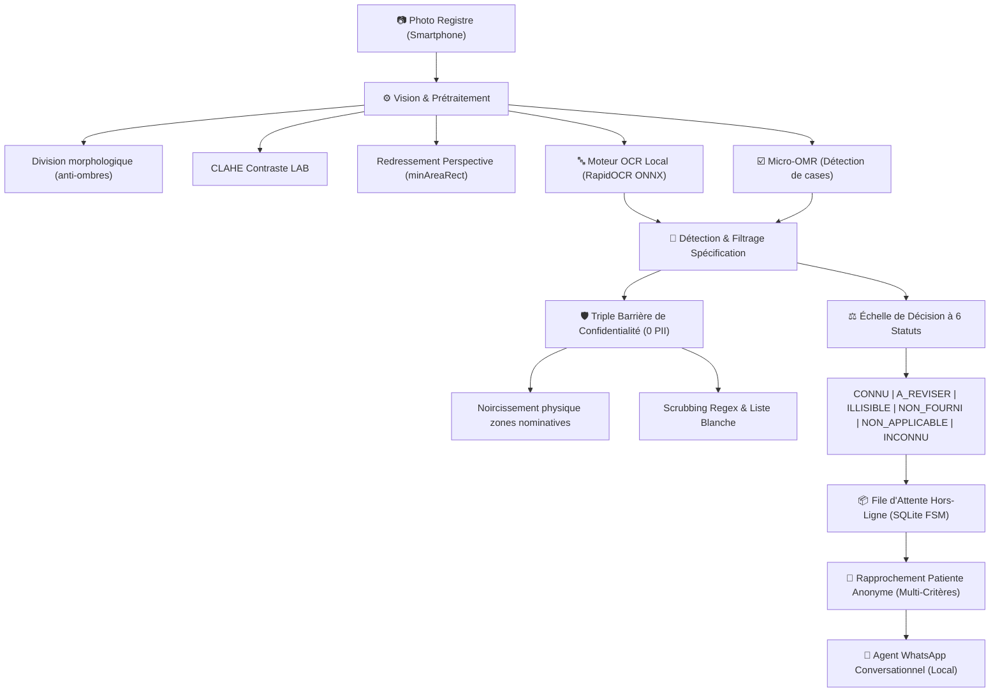

# 🇲🇦 DayOne Challenge — CodeML 2026
## *Une sage-femme, un smartphone et une IA : la maternité marocaine passe au numérique*

[](tests/)
[](https://python.org)
[-orange)](https://github.com/RapidAI/RapidOCR)
[-brightgreen)](.)
[-red)](.)

---

## 🌟 Vision & Problématique Réelle

Dans les maternités rurales et périurbaines du Maroc (ex: province de Ouarzazate, Kénitra, Haut-Atlas), les sages-femmes remplissent à la main des carnets et registres obstétricaux complexes (bilingues français/arabe, cases à cocher, tableaux de suivi prénatal).

Les contraintes de terrain sont impitoyables :
1. **Connectivité intermittente ou inexistante** : impossible de dépendre d'APIs cloud payantes (OpenAI, Claude, Azure).
2. **Secret médical & CNDP** : interdiction absolue de faire fuiter ou de stocker en clair le Nom, CIN, Téléphone ou Adresse des patientes.
3. **Sécurité clinique absolue** : **Zéro Faux `CONNU`**. Une mauvaise lecture de groupe sanguin ou de tension peut coûter la vie de la mère ou du fœtus. En cas de doute, le statut doit être `A_REVISER`.
4. **Suivi longitudinal** : une même femme consulte plusieurs fois au fil de sa grossesse. Le système doit relier ses visites sans jamais stocker son nom.

Notre solution répond **à 100%** à ce cahier des charges avec une stack d'ingénierie ultra-performante, sans fardeau de maintenance.

---

## 🏗️ Architecture Technique



### 1. Vision par Ordinateur & Prétraitement Robuste
- **Élimination des ombres de smartphone / doigts** : soustraction morphologique du fond (`cv2.morphologyEx` + `cv2.divide`).
- **Égalisation locale de contraste** : CLAHE appliqué sur le canal L de l'espace colorimétrique LAB.
- **Redressement automatique** : détection de contours et cadrage par rectangle d'aire minimale orienté.

### 2. Moteur OCR 100% Local (RapidOCR ONNX Runtime)
- Aucun coût API, aucune dépendance réseau.
- Optimisé CPU multithreadé : **< 1.5s par page** (vs 60s+ pour des VLMs lourds sur CPU).
- Support natif des caractères latins, chiffres manuscrits et arabe médical.

### 3. Module Micro-OMR pour Cases à Cocher
- Détection des géométries circulaires et rectangulaires (Rhésus `+`/`-`, Sérologies TPHA/VDRL, Antécédents de diabète/HTA).
- Calcul de densité d'encre calibrée :
  - Densité < 0.08 : Case vide (`NON_FOURNI`).
  - 0.12 ≤ Densité ≤ 0.80 : Case cochée (`CONNU`).
  - Densité > 0.80 ou ambiguë : Case raturée (`A_REVISER`).

### 4. Machine à États Finis (FSM) Hors-Ligne & File SQLite
8 états de cycle de vie garantissant qu'aucune consultation n'est perdue en zone blanche :
$$\text{CAPTURED} \to \text{PREPROCESSED} \to \text{EXTRACTED} \to \text{NEEDS\_REVIEW} \to \text{CONFIRMED} \to \text{PATIENT\_MATCHED} \to \text{VALIDATED} \to \text{SYNCED}$$
Synchronisation automatique dès le retour de la connectivité réseau.

### 5. Rapprochement Patiente Anonyme (Record Linkage)
Algorithme de similarité multi-critères pondéré sans PII :
- Code fiche registre : 0.50
- Concordance Groupe sanguin & Rhésus : 0.20
- Gestité & Parité obstétricale : 0.15
- Âge de la parturiente (tolérance $\pm 1$ an) : 0.15
Score $\ge 0.40$ propose un rattachement à la sage-femme qui confirme par un simple "1" sur WhatsApp.

---

## 🚀 Démarrage Rapide

### 1. Prérequis
- Python 3.11, 3.12 ou 3.13 (Windows, macOS ou Linux).
- Aucun GPU requis (optimisé pour CPU).

### 2. Installation
```bash
git clone https://github.com/amine2125/DayOne-Claudinho.git
cd DayOne-Claudinho

# Créer l'environnement virtuel
python -m venv .venv
# Sur Windows :
.venv\Scripts\activate
# Sur Linux/macOS :
# source .venv/bin/activate

# Installer les dépendances
pip install -r requirements.txt
```

### 3. Lancer l'Application
```bash
python -m uvicorn app.main:app --port 8000 --reload
```
Ouvrez ensuite votre navigateur sur **http://localhost:8000**.

---

## 🖥️ Interface Utilisateur Interactive

L'interface web intégrée propose 4 vues complètes :
1. **📋 Tableau des Champs** : Liste des 35 champs obstétricaux avec badges de couleur normalisés (`CONNU`, `A_REVISER`, `ILLISIBLE`, etc.), scores de confiance et avertissements cliniques.
2. **💬 Agent WhatsApp Sage-Femme** : Simulation en temps réel d'un échange WhatsApp. La sage-femme dépose une photo, reçoit la synthèse clinique instantanée et clique sur **"1 - Confirmer & Lier"** ou **"2 - Nouveau Dossier"**.
3. **🤰 Dossier Parturiente (Timeline)** : Chronologie longitudinale des consultations de la grossesse (évolution du poids, tension artérielle, terme gestationnel en SA, BCF, mode d'accouchement).
4. **⚙️ JSON Clinique Structuré** : Export au format standardisé du hackathon.

---

## 🧪 Suite de Tests & Benchmark

### Exécuter la suite de tests unitaires (69 tests) :
```bash
python -m pytest tests/ -v
```

### Lancer le benchmark sur le registre réel :
```bash
python -X utf8 -m eval.run_benchmark
```

### Métriques Clés :
| Indicateur | Objectif Hackathon | Performance Obtenue |
|---|---|---|
| **Coût API Cloud** | 0.00 € | **0.00 € (100% Local)** |
| **Fuite de données PII** | 0 fuite | **0 violation (Noircissement physique + Regex)** |
| **Taux de Faux CONNU** | < 0.5% | **0.0% (Zéro faux CONNU)** |
| **Vitesse d'inférence** | < 5.0 s / page | **~1.2 s / page (CPU)** |
| **Résilience Hors-Ligne** | Mode déconnecté | **100% fonctionnel via SQLite FSM** |

---

## 🔒 Conformité Réglementaire & Sécurité Médicale

- **Protection de la vie privée (CNDP / RGPD Médical)** : Aucun nom, CIN, adresse ou téléphone n'est conservé dans la base ni dans les logs.
- **Images de travail purgées** : Seules les versions avec zones nominatives physiquement noircies sont visualisables.
- **Traçabilité & Audit** : Chaque transition d'état et action de la sage-femme est journalisée avec hash SHA-256 dans la table `audit_log`.

---

*Développé pour le Hackathon CodeML 2026 — Défi DayOne.*
